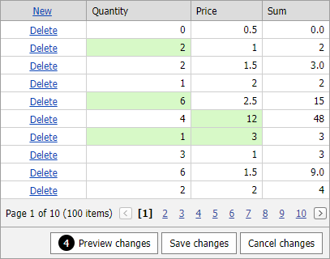

<!-- default badges list -->

[](https://supportcenter.devexpress.com/ticket/details/T114539)
[](https://docs.devexpress.com/GeneralInformation/403183)
<!-- default badges end -->
# GridView for Web Forms - How to calculate values dynamically in batch edit mode

<!-- run online -->
**[[Run Online]](https://codecentral.devexpress.com/t114539/)**
<!-- run online end -->

This example demonstrates how to create an unbound column (**Sum**) that changes its values based on other column values dynamically in batch edit mode.



Set the unbound column's [ShowEditorInBatchEditMode](https://docs.devexpress.com/AspNet/DevExpress.Web.GridDataColumnSettings.ShowEditorInBatchEditMode) property to `false` to make the column read-only in batch edit mode.

```aspx
<dx:GridViewDataTextColumn FieldName="Sum" UnboundType="Decimal" ReadOnly="true">
    <Settings ShowEditorInBatchEditMode="false" />
</dx:GridViewDataTextColumn>
```

Handle the client [BatchEditEndEditing](https://docs.devexpress.com/AspNet/js-ASPxClientGridView.BatchEditEndEditing) event to recalculate column values based on the changes and call the [SetCellValue](https://docs.devexpress.com/AspNet/js-ASPxClientGridViewBatchEditApi.SetCellValue(visibleIndex-columnFieldNameOrId-value)) method to set the new column value.

```js
function OnBatchEditEndEditing(s, e) {
    window.setTimeout(function () {
        var price = s.batchEditApi.GetCellValue(e.visibleIndex, "Price");
        var quantity = s.batchEditApi.GetCellValue(e.visibleIndex, "Quantity");
        s.batchEditApi.SetCellValue(e.visibleIndex, "Sum", price * quantity, null, true);
    }, 0);
}
```

## Files to Look At

<!-- default file list -->
- [Default.aspx](./CS/Default.aspx) (VB: [Default.aspx](./VB/Default.aspx))
<!-- default file list end -->


## Documentation

- [Batch Edit Mode](https://docs.devexpress.com/AspNet/16443/components/grid-view/concepts/edit-data/batch-edit-mode)

## More Examples

- [GridView for MVC - How to calculate values on the fly in batch edit mode](https://github.com/DevExpress-Examples/gridview-batch-edit-how-to-calculate-values-on-the-fly-t124603)
- [GridView for Web Forms - How to update total summaries on the client side in batch Edit mode](https://github.com/DevExpress-Examples/aspxgridview-how-to-update-total-summaries-on-the-client-side-in-batch-edit-mode-t114923)
- [GridView for Web Forms -  How to calculate unbound column and total summary values on the fly in batch edit mode](https://github.com/DevExpress-Examples/aspxgridview-batch-edit-how-to-calculate-unbound-column-and-total-summary-values-on-the-fly-t116925)
- [GridView for Web Forms - How to change a cell value based on another cell value in batch edit mode](https://github.com/DevExpress-Examples/aspxgridview-batch-edit-how-to-change-a-cell-value-based-on-another-cell-value-t558750)
